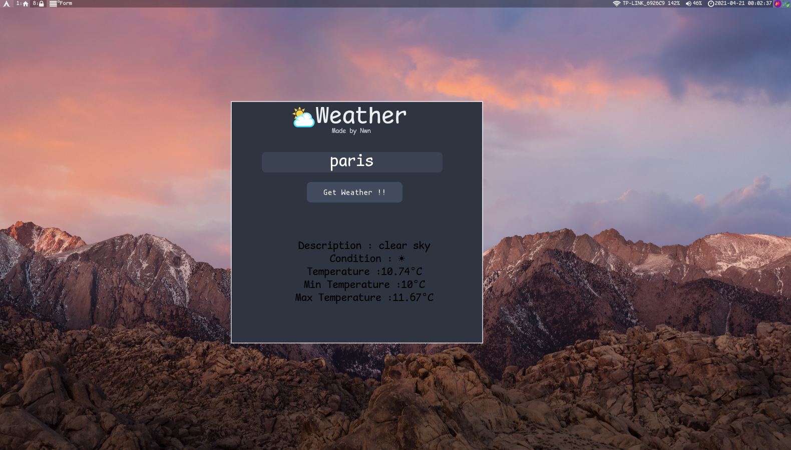

# Min Weather :


### Gui Weather Interface
simple GUI weather designer free and open source made with 100% python PyQt5 and openweather Api


## Installation :
+ you can comply it from source 
```
nuitka3 --follow-imports weather.py
```
Note that you need to have nuitka installed on your system 
archlinux users 
```
yay -S nuitka
```

+ or with pyinstaller 
```
pyinstaller  --onefile weather.py
```
+ finally go to https://openweathermap.org/ sign up for new account and get your api key for free then go to weather_base/api.py and put your api key in self.key variable



# TODO :


+ create a binary
+ Add icons
+ maybe change title

